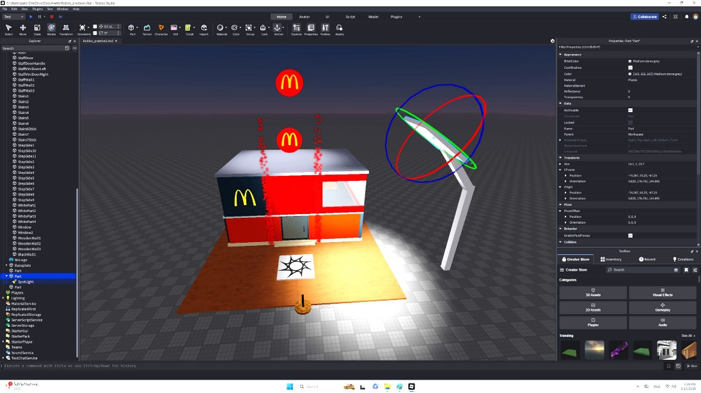

## 🧬 SECTION 1 — Header & DNA Passport

### [M2603]

### 2026 March Executive Summary
This period marks the absolute baseline initialization of the learner's software engineering journey, shifting from a passive consumer (gamer) to an active creator of software systems. Rather than executing rote tutorial replication, the focus was placed on developing a foundational mental model of computational thinking—learning to direct machine behavior through structured logic and 3D spatial environments. 

The learner successfully navigated critical runtime challenges, developing early engineering resilience while debugging script-suspension errors (Infinite Loops). The month culminated in the "Blank Screen Challenge," where the learner demonstrated profound knowledge retention by independently constructing a secure, stable Password Vault system from a completely blank text editor without any instructional guidance. Additionally, the learner exhibited early leadership and deep internalization of core logic by confidently articulating structural hierarchy and conditional flows to peers.

---

### 🎯 Learning Focus
* **Understanding how computers execute instructions:** Learned how variables, loops, and conditional statements control computer behavior.
* **Learning to break problems into smaller logical steps:** Practiced breaking simple game mechanics into smaller logical steps before implementation.
* **Building confidence through experimentation and repeated testing:** Developed early debugging habits through repeated testing and observation of script outputs.
* **Developing early habits of self-directed learning:** Began documenting discoveries, asking questions, and experimenting independently with AI support.

---

### ⚡ Technical Pathways
* ⚙️ 3D Spatial Navigation (XYZ Axis & Object Hierarchy)
* ⚙️ Data Typing (Strings, Numbers, Booleans)
* ⚙️ Conditional Logic (If-Else Branching)
* ⚙️ Data Validation Foundations (Password Matching Logic)
* ⚙️ Iterative Structures (While-Loops & Yielding Control)
* ⚙️ Mathematical Logic (Modulo Operator Arithmetic)
* ⚙️ Code Refactoring (Relative Assignment A = A + B)
---

### 📊 Evidence Snapshot  
  
* 📷 Screenshots Captured: 25  
* 🎥 Videos Recorded: 5  
* 📝 Reflections Written: 11  
* ⚙️ Systems Built: 12  
* 🐞 Debugging Cases Solved: 4

---

### 🔗 Associated Technical Labs
Explore the comprehensive technical concepts and documentation demonstrated during this period:
→ [Level 1: Computational Logic & Spatial Foundations](../../technical-lab/tech-level1-spatial-core.md#L260331a)

📺 *[Watch Final Demonstration Here](#automated-password-vault-system)*

# SECTION 2 — Key Learning Milestones

[Month-ID: #M2603]

## Overview of Key Learning Milestones

The following milestones capture the most significant moments of Sean's development throughout March 2026. Together, they illustrate his progression from navigating a 3D environment for the first time to applying logical reasoning, debugging techniques, and independent system construction. Each milestone represents a meaningful step in building computational thinking, problem-solving ability, and confidence as a young developer.

---

## 🚀 Milestone Blocks & Operational Evidence

<table>
  <tr>
    <td width="50%">
      <b>A</b> 
      
    </td>
    <td width="50%">
      <b>B</b> 
      
    </td>
  </tr>
  <tr>
    <td colspan="2" align="center">
      📷 <b><I>Caption:</I></b>Sean completed his first house construction project in Roblox Studio. When an incorrect floor thickness caused the stairs to become misaligned, he corrected the dimensions using scaling tools and restored the structure through iterative testing.
    </td>
  </tr>
  <tr>
    <td width="50%">
      <b>A</b> 
      
    </td>
    <td width="50%">
      <b>B</b> 
      
    </td>
  </tr>
  <tr>
    <td colspan="2" align="center">
      📷 <b><I>Caption:</I></b>While building a McDonald's-themed environment, Sean experimented with lighting and visual effects. By comparing parameter changes in the Properties window, he learned how brightness and light angles influence the atmosphere of a virtual space.
    </td>
  </tr>
  <tr>
    <td width="50%">
      <b>A</b> 
      
    </td>
    <td width="50%">
      <b>B</b> 
      
    </td>
  </tr>
  <tr>
    <td colspan="2" align="center">
      📷 <b><I>Caption:</I></b>While following a 24-step coding sequence, Sean encountered repeated mistakes and growing frustration. To stay organized, he developed a line-by-line verification method by marking each completed step on his reference sheet. This systematic approach eliminated skipped instructions and strengthened his confidence in debugging complex tasks.
    </td>
  </tr>
  <tr>
    <td width="50%">
      <b>Sean implements a Dynamic Color System</b> 
      
    </td>
    <td width="50%">
      <b>B</b> 
      
    </td>
  </tr>
  <tr>
    <td colspan="2" align="center">
      📷 <b><I>Caption:</I></b>Sean successfully implemented a conditional logic gate using a TextBox to create a user-driven color ingestion system. This project required precise execution sequencing and an understanding of how runtime engines intercept user input. Facing syntax hurdles during implementation, Sean demonstrated excellent engineering resilience, moving away from simple rote replication to independently auditing the underlying logic.
    </td>
  </tr>
    <tr>
    <td width="50%">
      <b>A</b> 
    

  

    </td>
    
    <td width="50%">
      <b>B</b> 
      
    </td>
  </tr>
  <tr>
    <td colspan="2" align="center">
      📷 <b><I>Caption:</I></b>Sean successfully implemented a conditional logic gate using a TextBox to create a user-driven color ingestion system. This project required precise execution sequencing and an understanding of how runtime engines intercept user input. Facing syntax hurdles during implementation, Sean demonstrated excellent engineering resilience, moving away from simple rote replication to independently auditing the underlying logic.
    </td>
  </tr>
 </table>