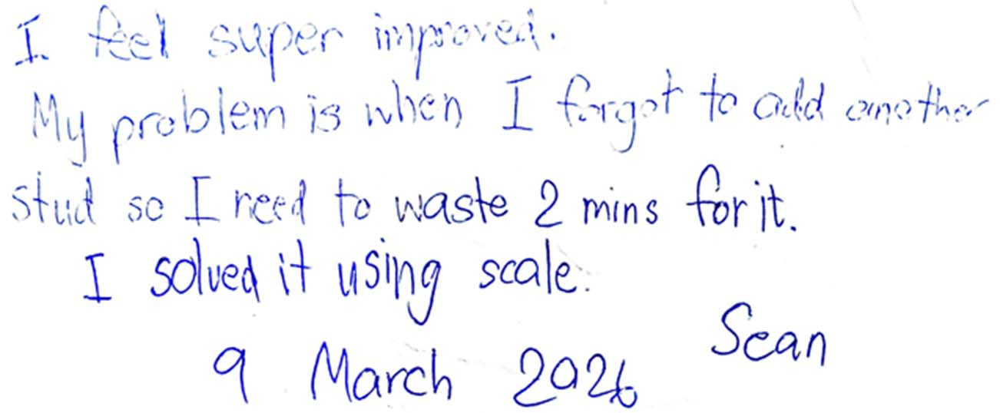
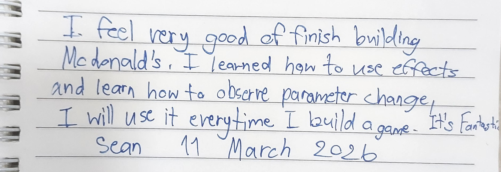
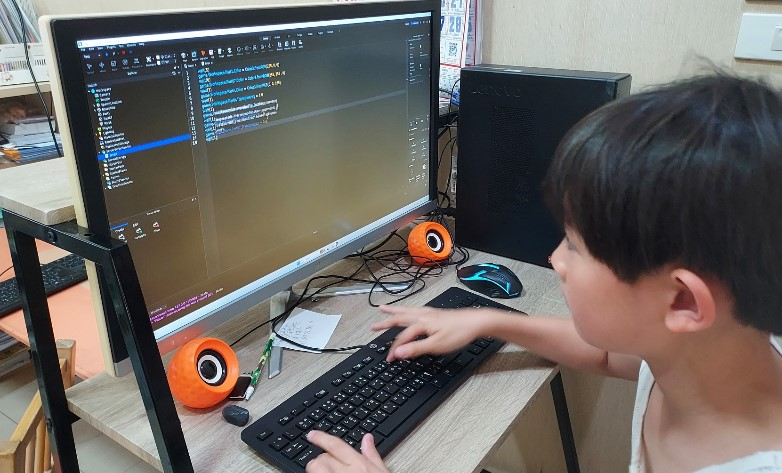
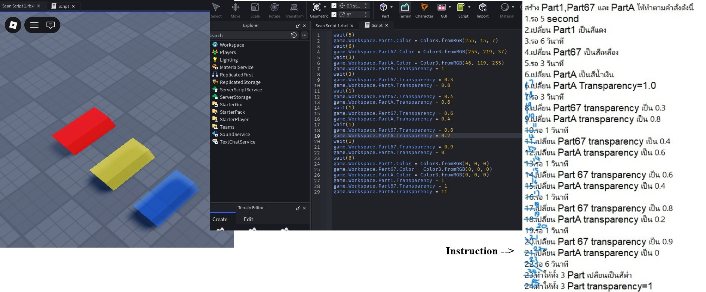
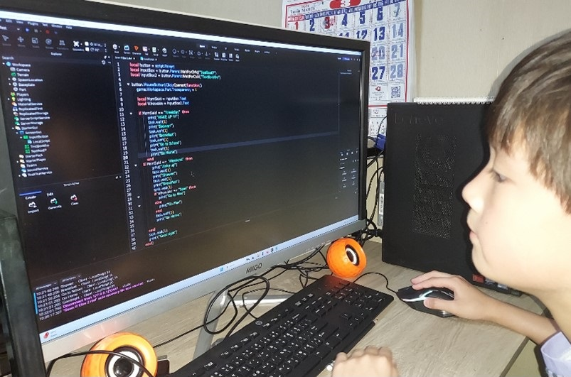
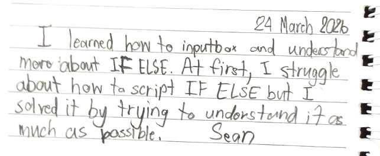
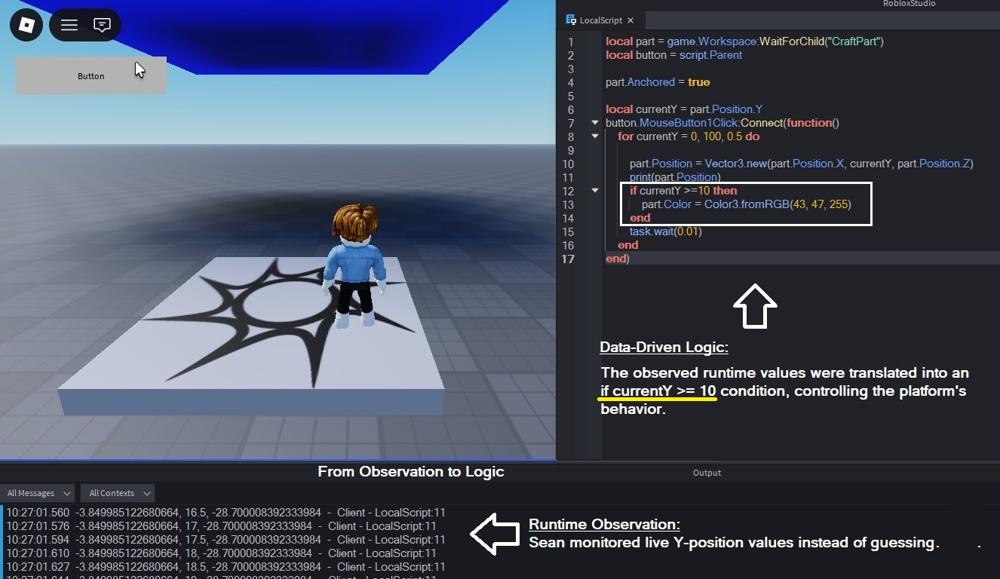
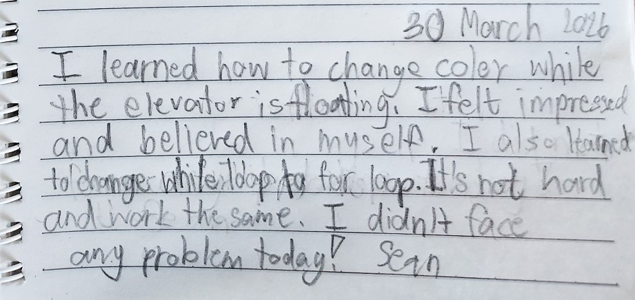

# SECTION 1 — Identity & DNA Passport

### [M2603]

### 2026 March Executive Summary
This period marks the absolute baseline initialization of the learner's software engineering journey, shifting from a passive consumer (gamer) to an active creator of software systems. Rather than executing rote tutorial replication, the focus was placed on developing a foundational mental model of computational thinking—learning to direct machine behavior through structured logic and 3D spatial environments. 

The learner successfully navigated critical runtime challenges, developing early engineering resilience while debugging script-suspension errors (Infinite Loops). The month culminated in the "Blank Screen Challenge," where the learner demonstrated profound knowledge retention by independently constructing a secure, stable Password Vault system from a completely blank text editor without any instructional guidance. Additionally, the learner exhibited early leadership and deep internalization of core logic by confidently articulating structural hierarchy and conditional flows to peers.

---

### 🎯 Learning Focus
* **Understanding how computers execute instructions:** Learned how variables, loops, and conditional statements control computer behavior.
* **Learning to break problems into smaller logical steps:** Practiced breaking simple game mechanics into smaller logical steps before implementation.
* **Building confidence through experimentation and repeated testing:** Developed early debugging habits through repeated testing and observation of script outputs.
* **Developing early habits of self-directed learning:** Began documenting discoveries, asking questions, and experimenting independently with AI support.

---

### ⚡ Technical Pathways
* ⚙️ 3D Spatial Navigation (XYZ Axis & Object Hierarchy)
* ⚙️ Data Typing (Strings, Numbers, Booleans)
* ⚙️ Conditional Logic (If-Else Branching)
* ⚙️ Data Validation Foundations (Password Matching Logic)
* ⚙️ Iterative Structures (While-Loops & Yielding Control)
* ⚙️ Mathematical Logic (Modulo Operator Arithmetic)
* ⚙️ Code Refactoring (Relative Assignment A = A + B)
---

### 📊 Evidence Snapshot  
  
* 📷 Screenshots Captured: 25  
* 🎥 Videos Recorded: 5  
* 📝 Reflections Written: 11  
* ⚙️ Systems Built: 12  
* 🐞 Debugging Cases Solved: 4

---

### 🔗 Associated Technical Labs
Explore the comprehensive technical concepts and documentation demonstrated during this period:
→ [Level 1: Computational Logic & Spatial Foundations](../../technical-lab/tech-level1-spatial-core.md#L260331a)

📺 *[Watch Final Demonstration Here](#automated-password-vault-system)*

# SECTION 2 — Technical Learning Journey

[Month-ID: #M2603]

## Overview of Key Learning Milestones

The following milestones capture the most significant moments of Sean's development throughout March 2026. Together, they illustrate his progression from navigating a 3D environment for the first time to applying logical reasoning, debugging techniques, and independent system construction. Each milestone represents a meaningful step in building computational thinking, problem-solving ability, and confidence as a young developer.

---
## 🚀 Milestone Blocks & Operational Evidence

<table>
<tr><td width="50%">
	      <b>First Architectural Build</b> 
	      </td>
	<td width="50%">
    <b>Building 1st House</b> 
    <video src="./assets/202603-assets/sean2603-1st-house-b.mp4" 
           autoplay 
           loop 
           muted 
           playsinline 
           width="100%" 
           style="border-radius: 6px; cursor: pointer; box-shadow: 0 4px 10px rgba(0,0,0,0.3);" 
           onclick="this.muted=false; if(this.requestFullscreen){this.requestFullscreen();}else if(this.webkitRequestFullscreen){this.webkitRequestFullscreen();}"
           onfullscreenchange="if(!document.fullscreenElement){this.muted=true;}"
           onwebkitfullscreenchange="if(!document.webkitFullscreenElement){this.muted=true;}">
    </video>
    

        👆 Click video to watch in Fullscreen with sound
    
</td>
</tr>
<tr>
<td width="50%">
	      <b>Student's Note</b> 
	      </td>
<td width="50%">
	      <b>Student's Note (Transcript)</b> 
		"I feel super improved. My problem is when I forgot to add another stud so I need to waste 2 mins for it. I solved it using scale.
			9March2026   -Sean"</td>
</tr>
<tr>
<td colspan="2" align="left">
	<b>📷 Mentor’s Insights & Technical Breakdown</b> 
	<b>● Key Skills Mastered: </b>Dimensional Accuracy, Sequential Building, Troubleshooting Structural Discrepancies. 
	<b>● Observation & Insight: </b>"Sean successfully followed the step-by-step instructions to build a basic house, demonstrating strong discipline. A key learning moment occurred when he realized the **floor thickness** was only 1 stud instead of the required 2 studs. This minor error significantly impacted the **alignment of the entrance stairs**. Rather than starting over, Sean used his previous knowledge to modify the dimensions and correct the structure. This shows his ability to identify technical errors and understand how one measurement (floor height) affects the entire architectural system."</td>
</tr>
<tr><td colspan="2" style="background-color: #f2f2f2; height: 15px; padding: 0;"></td></tr>
<tr>
<td width="50%">
	      <b>Designing with Custom Parameters</b>
	      </td>
<td width="50%">  <b>Observing Lighting Property Changes</b> 
	<video src="./assets/202603-assets/sean2603-light-decal-b.mp4" autoplay loop muted playsinline width="100%" style="border-radius: 6px; cursor: pointer; box-shadow: 0 4px 10px rgba(0,0,0,0.3);" onclick="this.muted=false; if(this.requestFullscreen){this.requestFullscreen();}
	else if(this.webkitRequestFullscreen){this.webkitRequestFullscreen();}" onfullscreenchange="if(!document.fullscreenElement){this.muted=true;}" onwebkitfullscreenchange="if(!document.webkitFullscreenElement){this.muted=true;}"> </video> 
	
 👆 Click video to watch in Fullscreen with sound 
 </td>
</tr>
<tr>
    <td width="50%">
	      <b>Student's Note</b>
	      </td>
    <td width="50%">
	      <b>Student's Note (Transcript)</b> 
		      "I feel very good of finish building McDonald's. I learned how to use effects and learn how to observe parameter change. I will use it everytime I built a game. It's fantastic.  Sean  11Mar2026"</td>
</tr>
<tr>
    <td colspan="2" align="left">
	<b>📷 Mentor’s Insights & Technical Breakdown</b> 
	<b>● Key Skills Mastered: </b>Lighting Environment Configuration, Parameter Observation (Trial & Error), External Asset Integration (Decals). 
	<b>● Observation & Insight: </b>"Sean learned to navigate the <b>Properties window</b> with more precision today. He quickly picked up the technique of <b>Before/After comparison</b> to identify which parameters were causing undesired lighting effects. Once he understood how to track these changes, he was able to independently adjust light angles and brightness to achieve the exact atmosphere he wanted for his shop."</td>
</tr>
<tr><td colspan="2" style="background-color: #f2f2f2; height: 15px; padding: 0;"></td></tr>
<tr>
    <td width="50%">
	      <b>Coding 24 Steps of Parameter Changes</b> 
	      </td>
    <td width="50%">
	      <b>Watching Code Run Line-by-Line</b> 
	      </td>
</tr>
<tr>
    <td width="50%">
	      <b>Student's Note</b> 
	      
    </td>
    <td width="50%">
	      <b>Student's Note (Transcript)</b> 
	“I faced a lot of problems during coding like restart, values, colors and typings. I was stressed. I solved it by checking line by line in the screen. Thai’s why I didn’t face any mistake now.    
		Sean  16Mar2026"</td>
</tr>
<tr>
    <td colspan="2" align="left">
	<b>📷 Mentor’s Insights & Technical Breakdown</b> 
	<b>● Key Skills Mastered: </b>Sequential Logic, Parameter Tracking, Runtime Observation, Pattern Recognition 
	<b>● Observation & Insight: </b>"Today's lesson focused on helping Sean connect individual code instructions with their visible effects inside the game world. By repeatedly modifying parameters across 24 sequential steps, he observed how small changes in values, colors, and timing produced different outcomes. Sean initially felt overwhelmed by the volume of instructions, but he developed a <b>line-by-line tracking</b> method to stay organized. More importantly, he began recognizing patterns between <b>script execution and object behavior</b>—an essential foundation for understanding automation through While Loops and For Loops in later lessons."</td>
</tr>
<tr><td colspan="2" style="background-color: #f2f2f2; height: 15px; padding: 0;"></td></tr>
<tr>
    <td width="50%" align="left"> <b>Mapping Daily Routines into IF-ELSE Logic</b> 
	      </td>
    <td width="50%">
	      <b>IF-ELSE Coding with Daily Routines</b> 
    

	  

	    
	    
🔍 Click image to isolate and expand code viewer

	

		

	    
	    
× Close

	
</td>
</tr>
<tr>
    <td width="50%">
	      <b>Student's Note</b> 
	      </td>
    <td width="50%">
	      <b>Student's Note (Transcript)</b> 
	
“I learned how to inputbox and understand more about IF ELSE. At first, I struggle about how to script IF ELSE but I solved it by trying to understand it as much as possible.  Sean"
</td>
  </tr>
  <tr>
  <td colspan="2" align="left" style="padding:4px; line-height:1.4;">
    <b>📷 Mentor's Insights & Technical Breakdown</b> 
    <b>• Key Skills Mastered: </b>Decision Mapping, Conditional Logic (IF-ELSE), User Input Processing (TextBox), Real-World to System Translation, Logical Persistence. 
    <b>• Observation & Insight: </b>"<b>(Success):</b> Sean successfully learned how user input can be processed through IF-ELSE conditions to trigger different outcomes inside a program. He demonstrated growing confidence in connecting TextBox input, decision-making logic, and resulting system behavior. <b>(Insight):</b> Rather than memorizing IF-ELSE syntax, Sean was encouraged to think about decision-making patterns from everyday life. By converting familiar daily routines into conditional logic, he began to understand that programming is fundamentally the process of translating real-world decisions into structured rules that a computer can follow. His willingness to keep analyzing the problem until it made sense reflects an emerging habit of pursuing understanding over memorization."
  </td>
</tr>
<tr><td colspan="2" style="background-color: #f2f2f2; height: 15px; padding: 0;"></td></tr>
<tr>
    <td width="50%">
	      <b>Tracking Position Through Runtime Output</b> 
	      </td>
    <td width="50%">
	      <b>Do While to For Loop</b>
	      </td>
</tr>
<tr>
    <td width="50%">
	      <b>Student's Note</b>
	      </td>
    <td width="50%">
	      <b>Student's Note (Transcript)</b> 
	“I learned how to change color while the evelator is floating. I felt impressed and belived in myself. I also learned to change while-loop to for-loop. It's not hard and work the same. I didn't face any problem today!  Sean"</td>
</tr>
<tr>
    <td colspan="2" align="left">
	<b>📷 Mentor’s Insights & Technical Breakdown</b> 
	<b>• Key Skills Mastered: </b>Runtime Observation, Data-Driven Logic, Comparative Programming, Code Refactoring. 
	<b>• Observation & Insight: </b>Sean learned to use runtime data as a decision-making tool rather than relying on guesswork. By tracking Y-position values in the Output window, he identified the exact threshold required to trigger a color change and connected numerical data to physical behavior in the 3D environment. After completing the system with a While Loop, Sean successfully rebuilt the same behavior using a For Loop while preserving all functional outcomes. This demonstrates an important shift in thinking: he is beginning to view programming as a collection of tools that can achieve the same objective through different approaches.</td>
</tr>
<tr><td colspan="2" style="background-color: #f2f2f2; height: 15px; padding: 0;"></td></tr>
<tr>
    <td width="50%">
      <b>Modulo Operator</b> 
    

	  

	    
	    
🔍 Click image to isolate and expand code viewer

	

	

	    
	    
× Close

	

	

	  </td>
	<td width="50%"> <b>Password-Vault</b>  
		<video src="./assets/202603-assets/sean2603-pass-vault.mp4" autoplay loop muted playsinline width="100%" style="border-radius: 6px; cursor: pointer; box-shadow: 0 4px 10px rgba(0,0,0,0.3);" onclick="this.muted=false; if(this.requestFullscreen){this.requestFullscreen();}
		else if(this.webkitRequestFullscreen){this.webkitRequestFullscreen();}" onfullscreenchange="if(!document.fullscreenElement){this.muted=true;}" onwebkitfullscreenchange="if(!document.webkitFullscreenElement){this.muted=true;}"> </video> 
		
 👆 Click video to watch in Fullscreen with sound 

    </td>
  </tr>
   <tr>
    <td width="50%">
	      <b>Student's Note</b>
	      </td>
    <td width="50%">
	      <b>Student's Note (Transcript)</b> 
	“Today I learned modulo operator, it seperates odd number and even number. I also learned coding on Blank Screen. I started by using Objects then button and TextBox, next was coding. I use my understanding to code, not memory. I feel very improved.    Sean"</td>
</tr>
<tr>
    <td colspan="2" align="left">
	<b>📷 Mentor’s Insights & Technical Breakdown</b> 
	<b>• Key Skills Mastered: </b>Modulo Mathematics, GUI Interaction (TextBox/Buttons), Code Refactoring (Blank Screen), and Conditional Logic. 
	<b>• Observation & Insight: </b>Sean demonstrated exceptional learning transfer during today's Blank Screen Challenge. After completing both guided and fill-in-the-blank exercises, he was asked to rebuild the Password Vault system from a completely empty editor without any template or process guidance. Syntax assistance remained available, but all system structure and logic had to be reconstructed independently.	Rather than relying on memorized code, Sean rebuilt the solution by following the underlying sequence of reasoning—starting with objects, then user inputs, and finally the conditional logic connecting them. His reflection, "I use my understanding to code, not memory," accurately describes the significance of this milestone. The challenge suggests a transition from reproducing code patterns toward understanding how individual components interact within a complete system.</td>
  </tr>
 </table>
  
<b>📖 Learning Progress Summary1</b> Throughout March, Sean's work gradually progressed from guided construction to independent reasoning. Each milestone presented in this section represents more than a completed task—it reflects the steady development of systematic thinking, observation, logical reasoning, and confidence. The following section provides a closer look at the learning environment and mentoring approach that shaped these technical achievements.