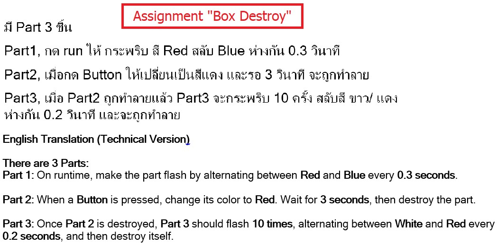
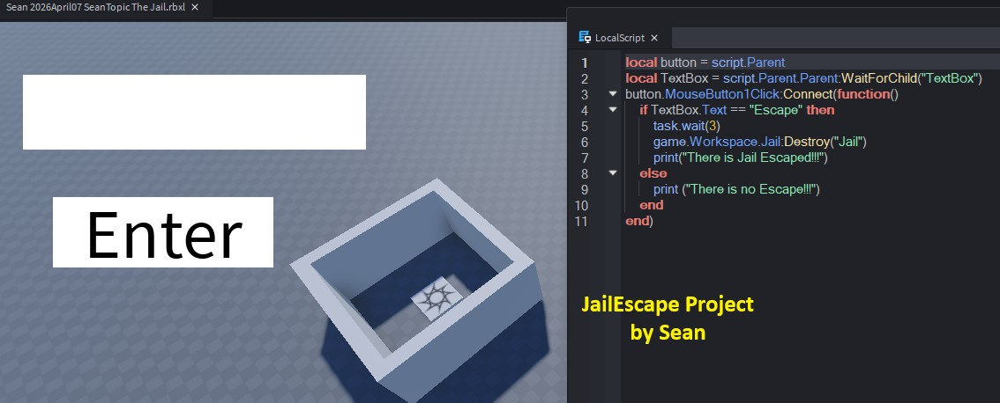
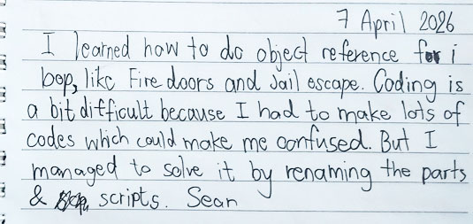
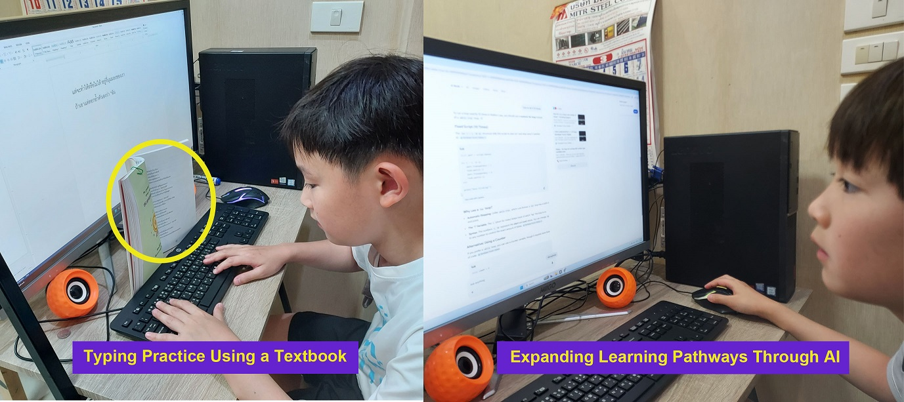
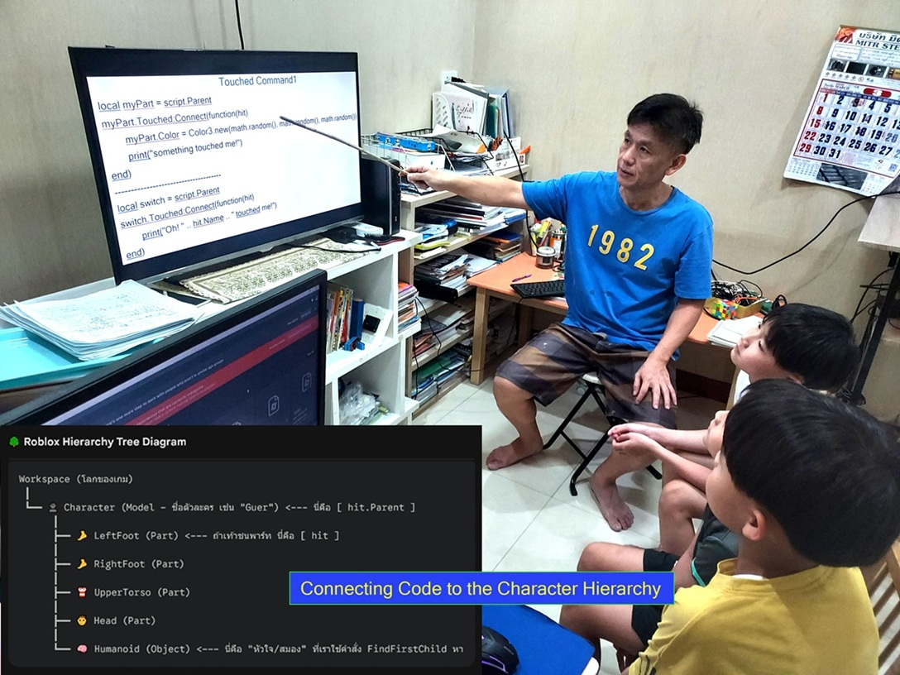

# SECTION 1 — Identity & DNA Passport

### [M2604]

## 2026 April Executive Summary
This period represents a critical "Engineering Breakthrough" for the learner, transitioning from structured rule-following to autonomous design and disciplined software debugging. The learning curve shifted decisively from syntax replication to complex system architectural thinking, multi-axis motion control, and lifecycle dependency management.

The learner demonstrated outstanding engineering resilience when facing complex logic barriers, voluntarily adopting industry-standard "Paper Tracing" methodologies to mathematically debug code rather than relying on guesswork. The month was defined by a substantial increase in "Blank Screen Challenges," where the learner advanced from fill-in-the-blank assignments to writing pure, optimized multi-object systems completely from a blank slate. Furthermore, the learner demonstrated exceptional empirical verification behaviors—building programmatic "visual rulers" to test spatial physics theories—and showcased mature technical leadership by deconstructing abstract event architectures to mentor peers. This comprehensive mastery marks the conclusion of linear structured lessons and triggers the strategic advancement into autonomous Project-Based Learning (Sandbox Mode).

---

### 🎯 Learning Focus
* **Transition from Guesswork to Analytical Tracing:** Voluntarily adopting manual paper tracing to track complex loop variables and eliminate logic race conditions.
* **Deliberate Practice via Blank Screen Challenges:** Rebuilding multi-stage, trigger-based systems completely from an empty editor to achieve pure code autonomy.
* **Empirical Testing & 3D Vector Logic:** Mastering the Cartesian coordinate system by programmatically creating visual models to verify mathematical engine spaces.
* **Clean Code & Refactoring Mindset:** Overcoming system complexity by implementing systematic renaming conventions and consolidating multiple functions into singular optimized logic blocks.

---

### ⚡ Technical Pathways
* ⚙️ **Advanced Motion Logic & Axis Manipulation** (X, Y, Z & Vector3 Height Controls)
* ⚙️ **Nested Control Loops** (Bi-directional Nested For Loops for Up & Down automation)
* ⚙️ **Dynamic Object Mapping** (Dynamic string concatenation `game.Workspace["Wall"..i]`)
* ⚙️ **Inter-Object Lifecycle Dependencies** (Multi-part chain reactions & `Destroy` methods)
* ⚙️ **Event-Driven Programming API** (`Touched` Events & `Humanoid` Class Hierarchy)
* ⚙️ **Independent Code Optimization** (Leveraging Google/AI for functional refactoring)

---

### 📊 Evidence Snapshot  
  
* 📷 Screenshots Captured: 32  
* 🎥 Videos Recorded: 8  
* 📝 Reflections Written: 14  
* ⚙️ Systems Built: 16  
* 🐞 Debugging Cases Solved: 7  
* 📝 Blank Screen Challenges Mastered: 5

---

### 🔗 Associated Technical Labs
Explore the comprehensive technical concepts and documentation demonstrated during this period:
→ [Level 2: Advanced Motion Logic & Event Architectures](../../technical-lab/tech-level2-motion-events.md#L260412a)

📺 *[Watch Final Demonstration Here](#synchronized-double-door-system)*

# SECTION 2 — April Engineering Growth Highlights
[Month-ID: #M2604]
## Overview of Key Learning Milestones

The following milestones capture the most significant moments of Sean's development throughout April 2026. Together, they illustrate his progression from a guided script developer to an autonomous systems architect who designs requirements, optimizes algorithms, and conducts empirical testing. Each block represents a measurable step in deep computational thinking and disciplined software engineering.

---
## 🚀 From Static Coordinates to Dynamic Movement

During April, Sean advanced from understanding static object positioning to engineering dynamic object behavior within a three-dimensional environment. Rather than treating coordinates as fixed values, he learned to continuously update object positions through iterative execution, gradually expanding from single-object movement to synchronized multi-object systems driven by coordinate logic.

<table>
<tr><td colspan="2" align="center" style="background-color: #cccccc; height: 15px; padding: 0;" ><b>Engineering Progression: Coordinate-Based Motion Systems</b></td></tr>
<tr><td width="50%">
          <b>1.Understanding Spatial Coordinates</b> 
          </td>
    <td width="50%">
    <b>2.Controlling Horizontal Motion</b> 
          </td>
</tr>
<tr>
<td width="50%">
          <b>3.Position-Based Event Control</b> 
          </td>
<td width="50%">
          <b>4.Extending Motion into Three Dimensions</b> 
          </td>
</tr>
<tr>
<td width="50%">
          <b>5.Coordinating Multiple Objects</b> 
          </td>
<td width="50%">
        <b>Student's Reflection</b>
          </td></td>
</tr>
<tr>
<td colspan="2" align="left"><b>Student's Note (Transcript)</b>
 "Today, I learned part moving by coding. It is like an elevator but moves on the ground. I used For-i-Loop to do it. I did face a problem today when the Fire is not burning the part, I solved it by making the code know what is Fire. It was easy but very interesting. Sean"
</td>
</tr>
<tr>
<td colspan="2" align="left">
    <b>📷 Mentor’s Insights & Technical Breakdown</b>

    <b>● Key Skills Mastered: </b>3D Spatial Reasoning, Cartesian Coordinate Mapping, Runtime Coordinate Verification, Coordinate-Based Motion Control, Position-Triggered Events, Multi-Axis Programming, Multi-Object Synchronization, and Iterative Motion Logic (For Loops).
    
    <b>● Observation & Insight: </b>"April marked Sean's transition from understanding coordinates as static numerical values to using them as an active control mechanism for software behavior. His learning progressed through five increasingly complex engineering challenges: first establishing a mental model of the XYZ coordinate system, then controlling horizontal motion, introducing position-triggered interactions, extending movement into the vertical axis, and finally synchronizing multiple objects into a functional Double Door mechanism.
    
	Rather than relying on trial-and-error, Sean repeatedly verified live coordinate values through the Output window before modifying his logic. This systematic workflow demonstrates an emerging engineering habit of validating runtime data before making design decisions. By the end of the progression, Sean was no longer simply moving objects; he was engineering predictable object behaviors through coordinate mathematics, iterative execution, and synchronized system control."
</td>
</tr>
<tr><td colspan="2" style="background-color: #cccccc; height: 15px; padding: 0;"></td></tr>
</table>

## 🚀 Developing Computational Reasoning Through Debugging

Sean progressed from simply fixing programming errors to understanding why software behaves the way it does during execution. Rather than relying on repeated trial-and-error, he gradually developed computational reasoning by learning to simulate, observe, and analyze program behavior systematically.

Each activity below represents a different stage in this progression—from mental simulation, to execution-flow reasoning, and finally to runtime verification.

<table>
<tr><td colspan="2" align="center" style="background-color: #cccccc; height: 15px; padding: 0;" ><b>Learning to Think Through Program Execution</b></td></tr>
<tr>
<td width="50%">  <b>Simulating Program Execution on Paper</b>

	  

	    
	 <!--   
🔍 Click image to isolate and expand code viewer
-->
		 🔍 Click image to isolate and expand code viewer
	

		

	    
	    
× Close

	

	
</td>
<td width="50%"><b>Understanding Execution Order Through Logic Debugging</b>
          </td>
</tr>
<tr>
    <td width="50%">
          <b>Observing Runtime Behavior with Breakpoints</b>
          </td>
    <td width="50%">
          <b>Student's Note</b>
          </td>
</tr>
<tr>
    <td  colspan="2" align="left"><b>Student's Note (Transcript)</b>
2April2026
     "I have problems from arrangement of coding. The part doesn't show the color I want. I had to rearrange the command and make it complete. Sean"
    
3April2026
     "I learned trace variable on paper. It's not hard, I searched google for some instructions. It was my new experience. I also learned how to change For loop to While loop, how to add more condition Ex. Count 10 --> Count 5. Sometimes, the hard section is so easy that I overlook it. <b>My knowledge is enough to do but I can't think of it.</b> I gained lots of experience today. Thank you Dad!.   Sean"
</td>
</tr>
<tr>
    <td colspan="2" align="left"><b>📷 Mentor’s Insights & Technical Breakdown</b> 
    <b>● Key Skills Mastered: </b>Runtime Reasoning, Manual Program Simulation, Execution Flow Analysis, Variable Tracing, Breakpoint-Based Debugging, Code Refactoring (For → While Loop), and Independent Technical Research. 
    <b>● Observation & Insight: </b>Sean reached an important cognitive milestone by learning to visualize program execution before relying on the computer. Instead of repeatedly modifying code through trial-and-error, he first simulated loop iterations, variable updates, and conditional branches on paper to understand how the program would behave during execution. This marked the beginning of systematic runtime reasoning rather than guesswork.
	As his understanding deepened, Sean discovered that software behavior depends not only on **what** instructions are written but also on **when** they are executed. By investigating an incorrect staircase color sequence, he identified that the defect originated from execution order rather than faulty logic. Reordering the execution sequence resolved the problem and strengthened his understanding of execution flow and runtime state.
	Finally, Sean progressed from manually reasoning about program behavior to observing it directly through breakpoints and runtime output tracing. Rather than guessing why the software behaved unexpectedly, he began verifying execution step by step using evidence generated during runtime. This progression—from paper simulation, to execution-flow reasoning, to runtime observation—demonstrates the emergence of disciplined computational thinking and engineering-oriented debugging practices. </td>
</tr>
<tr><td colspan="2" style="background-color: #cccccc; height: 15px; padding: 0;"></td></tr>
</table>

## 🚀 Sean's Evolution Toward Independent Software Construction

By the end of April, Sean had progressed beyond completing guided programming exercises. He began independently constructing small software systems by translating functional requirements into executable programs. Each challenge below demonstrates increasing ownership over software design, implementation, and verification.

April was not the month Sean learned the most new programming commands; it was the month he became capable of using what he already knew to construct software independently.

<table>
<tr><td colspan="2" align="center" style="background-color: #cccccc; height: 15px; padding: 0;" ><b>Transforming Ideas into Logic, and Logic into Software</b></td></tr>
<tr>
<td width="50%">  <b>Sean Designing a Programming Challenge</b>

🔍 Click image to isolate and expand code viewer

	    
	    
× Close

	

	
</td>
<td width="50%"><b>Representative Program Implementations</b>

🔍 Click image to isolate and expand code viewer

		

	    
	    
× Close

	

	
</td>
</tr>
<tr>
    <td width="50%">
          <b>Program Execution Demonstration</b> <video src="./assets/202604-assets/sean2604-constr1-c-jailescape.mp4" autoplay loop muted playsinline width="100%" style="border-radius: 6px; cursor: pointer; box-shadow: 0 4px 10px rgba(0,0,0,0.3);" onclick="this.muted=false; this.paused ? this.play() : this.pause(); if(this.requestFullscreen){this.requestFullscreen();} else if(this.webkitRequestFullscreen){this.webkitRequestFullscreen();}" onfullscreenchange="if(!document.fullscreenElement){this.muted=true;}" onwebkitfullscreenchange="if(!document.webkitFullscreenElement){this.muted=true;}"></video>
 👆 Click video to watch in Fullscreen with sound 
</td>
    <td width="50%">
          <b>Student's Note</b>
          </td>
</tr>
<tr>
    <td  colspan="2" align="left"><b>Student's Note (Transcript)</b>
I learned how to do object reference For-i loop, like Fire doors and Jail escape. Coding is a bit difficult because I had to make lot of codes which could make me confused. But I managed to solve by renaming the parts & scripts.  Sean
</td>
</tr>
<tr>
    <td colspan="2" align="left"><b>📷 Mentor’s Insights & Technical Breakdown</b> 
<b>    ● Key Skills Mastered: </b>Requirement Interpretation, Independent Program Construction, Software Logic Design, Event-Driven Programming, Variable-to-Object Mapping, AI-Assisted Problem Solving, Technical Communication, and Knowledge Transfer.
    <b>● Observation & Insight: </b>**Rather than introducing an entirely new programming concept, this stage required Sean to independently reconstruct and extend interaction patterns he had previously learned. Instead of reproducing an existing solution, he interpreted new requirements, designed the program flow, implemented the logic, and verified the software behavior until the objectives were achieved. This demonstrates an important transition from guided programming to independent software construction.
    Another significant milestone emerged outside the code itself. Sean began creating programming challenges for his younger brothers, requiring him to translate his own mental model into clear, executable instructions. Teaching others forced him to organize his reasoning explicitly rather than relying on intuition alone, strengthening both his technical communication and software design thinking.
    Sean also demonstrated increasingly mature software design by organizing object references systematically and dynamically constructing object names (Wall1–Wall3) instead of writing repetitive statements for every object individually.
</td>
</tr>
<tr><td colspan="2" style="background-color: #cccccc; height: 15px; padding: 0;"></td></tr>
</table>

# SECTION 3 — Learning Environment & Mentor Reflection
## Learning Environment

Authentic modern engineering development requires an ecosystem focused on empirical validation, collective code review, structured communication, and leadership. Throughout April, the training framework emphasized direct peer-mentorship and deep self-driven discovery. Lessons moved beyond individual terminal compilation, utilizing team-centered logic translation where abstract rules were transformed into interactive physical models. The following historical entries showcase the environmental parameters supporting Sean's technical jump throughout the month.

<table>
  <tr>
    <td align="center"><b>Collaborative Cartesian Spatial Auditing Sessions</b>  <video src="./assets/202604-assets/sec3-sean2604-axis1-1.mp4" autoplay loop muted playsinline width="100%" style="border-radius: 6px; cursor: pointer; box-shadow: 0 4px 10px rgba(0,0,0,0.3);" onclick="this.muted=false; if(this.requestFullscreen){this.requestFullscreen();}else if(this.webkitRequestFullscreen){this.webkitRequestFullscreen();}" onfullscreenchange="if(!document.fullscreenElement){this.muted=true;}" onwebkitfullscreenchange="if(!document.webkitFullscreenElement){this.muted=true;}"></video>
👆 Click video to watch in Fullscreen with sound
</td>
</tr>
<tr>
    <td colspan="2" align="left"><b>📖 Learning Insight</b>
Rather than reviewing abstract coordinate rules on a presentation slide, the group engaged in active collaborative data-model mapping. Using Sean's programmatically generated 'visual rulers,' the brothers audited the 3D game engine grid as a cohesive development team. This hands-on spatial cross-referencing translated mathematical vectors into an intuitive 3D coordinate compass, removing development trial-and-error completely from future structural maps.
</td>
  </tr>
 </table>
<table>
  <tr>
    <td align="center"><b>Explaining Software Logic Through Peer Mentorship</b>  <video src="./assets/202604-assets/sec3-sean2604-topic2peer-1.mp4" autoplay loop muted playsinline width="100%" style="border-radius: 6px; cursor: pointer; box-shadow: 0 4px 10px rgba(0,0,0,0.3);" onclick="this.muted=false; if(this.requestFullscreen){this.requestFullscreen();}else if(this.webkitRequestFullscreen){this.webkitRequestFullscreen();}" onfullscreenchange="if(!document.fullscreenElement){this.muted=true;}" onwebkitfullscreenchange="if(!document.webkitFullscreenElement){this.webkitFullscreenElement?null:this.muted=true;}"></video>
👆 Click video to watch in Fullscreen with sound
</td>
</tr>
<tr>
    <td align="left"><b>📖 Learning Insight</b>
Teaching software design requires ideas to be translated into clear computational steps before they can be implemented by others. After completing his own programming challenges, Sean began creating assignments and explaining program requirements to his younger brother. Rather than demonstrating syntax, he organized the desired software behavior into a logical sequence that another learner could understand and implement. This represents an important developmental milestone—from constructing software independently to communicating computational thinking clearly enough for others to build upon it.
</td>
  </tr>
<table>
  <tr>
        <td width="50%">
          <b>Expanding Independent Learning Capabilities</b>
          </td>
</tr>
<tr>
    <td align="left"><b>📖 Learning Insight</b>
Typing was developed not merely as a keyboard skill, but as a foundation for communicating ideas precisely. As Sean became more fluent in expressing problems through written language, AI evolved into an additional learning pathway where effective questioning required the same logical organization used in programming—defining context, describing problems step by step, and specifying the desired outcome. In this way, interacting with AI reinforced computational thinking rather than replacing it. This marked the beginning of a new stage of independent learning, enabling Sean to explore unfamiliar concepts beyond classroom instruction. In the following months, AI gradually became a research companion that supported increasingly complex programming projects and self-directed exploration.
</td>
  </tr>
 </table>
 <table>
  <tr>
    <td width="50%" align="center"><b>Connecting Code to Interactive Game Systems</b>

🔍 Click image to isolate and expand code viewer

	    
	    
× Close

	

	
</td>
</tr>
<tr>
    <td align="left"><b>📖 Learning Insight</b>
Interactive gameplay requires more than writing code. Students must first understand how the game engine represents characters internally before meaningful interactions can be programmed. By introducing the Character hierarchy, Humanoid object, and body-part relationships, Sean developed the mental model necessary to control health, collisions, spawning, teleportation, and future gameplay mechanics. This foundation reduced unnecessary trial-and-error and allowed increasingly complex programming concepts to build naturally upon an organized understanding of the game system.
</td>
  </tr>
 </table>

## 2026 April Mentor Reflection 

<b>Preparing for Project-Based Learning</b>

Throughout April, the instructional focus shifted away from acquiring additional programming syntax toward building the mental models required for independent software construction. Rather than introducing increasingly advanced language features, the learning process deliberately revisited coordinates, loops, conditional logic, debugging, object hierarchies, and event-driven programming through progressively more challenging scenarios.

The objective was never to maximize the number of programming commands Sean could memorize. Instead, the emphasis was on helping him understand how computer systems organize information, execute instructions, and respond to interaction. By repeatedly solving different problems using the same foundational concepts, Sean gradually learned to transfer existing knowledge to unfamiliar situations instead of searching for entirely new syntax.

An equally important transition occurred in Sean's way of thinking. Programming gradually became less about writing code and more about translating imagination into computational logic within real engineering constraints. Once he understood how the system worked internally, syntax became a communication tool rather than the primary obstacle to software creation.

Sean's own reflection captured this transition remarkably well:

<b>"My knowledge is enough to do but I can't think of it."</b>

This realization marked a significant milestone. Sean recognized that the limiting factor was no longer technical knowledge alone, but the ability to organize, connect, and apply existing concepts creatively. Throughout April, the learning environment therefore focused on strengthening computational reasoning, systematic debugging, independent problem solving, and software communication.

These foundations prepared Sean for the next stage of his learning journey, where authentic software projects—not isolated programming exercises—would become the primary vehicle for developing software design thinking, engineering judgment, and increasingly independent system construction.

Ultimately, software creation begins with imagination, but succeeds through the ability to translate ideas into computational logic within real technical constraints. April was designed to cultivate precisely that ability before introducing more advanced engineering concepts.

📄 **[Return to main page](../../README.md)