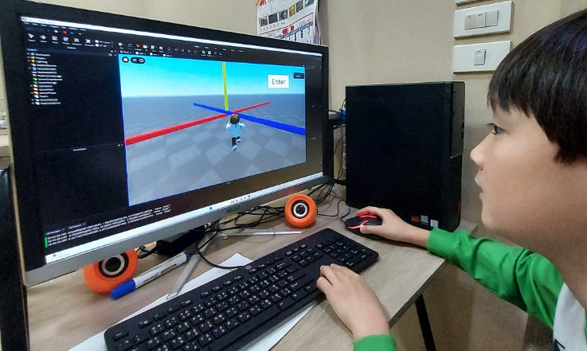
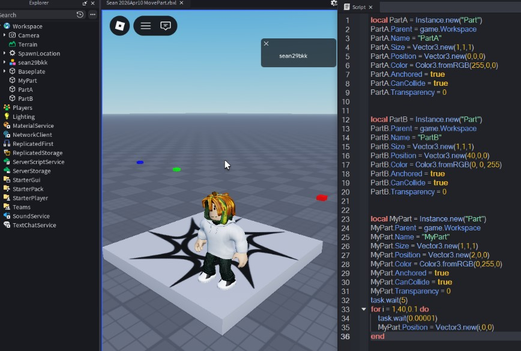
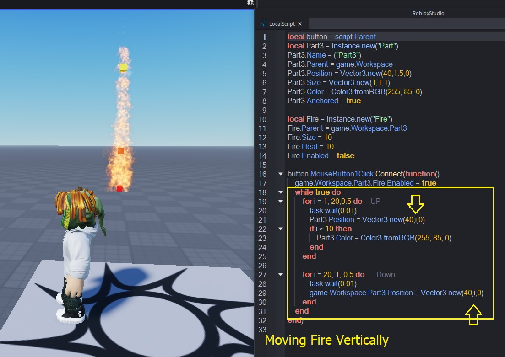
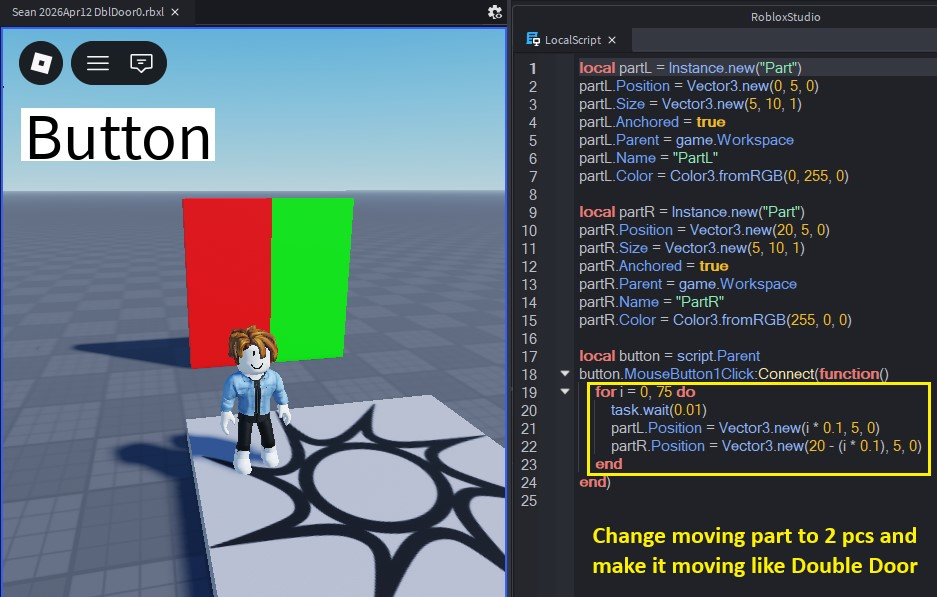
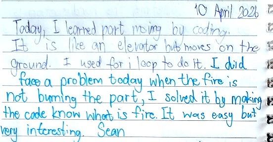
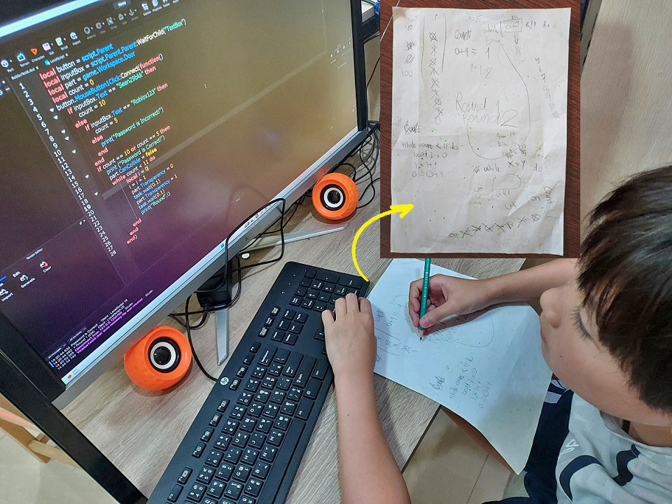
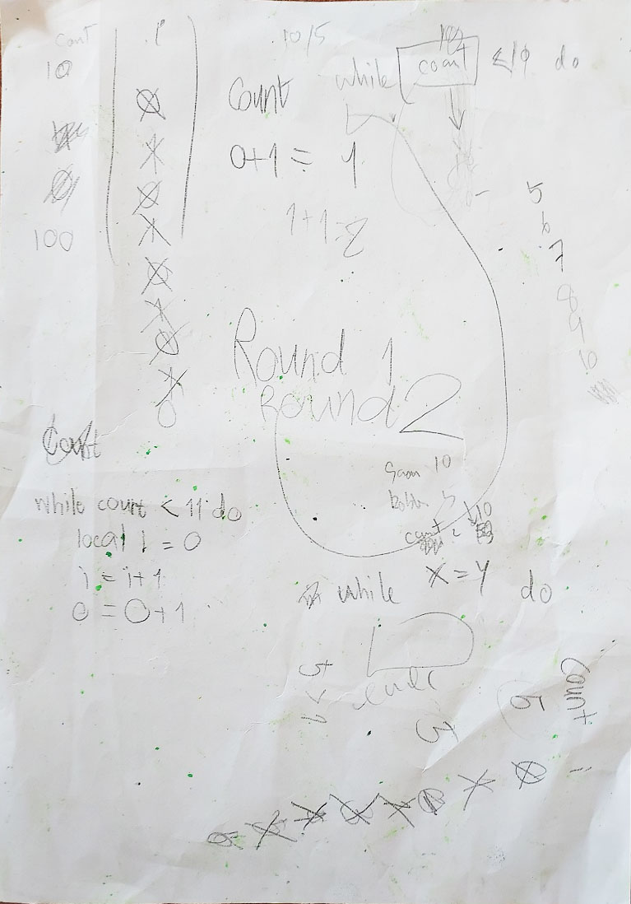
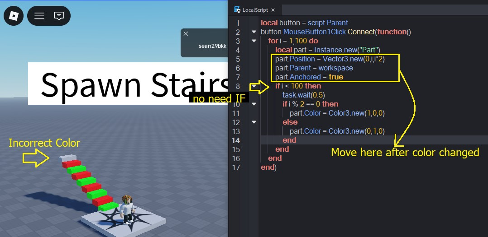
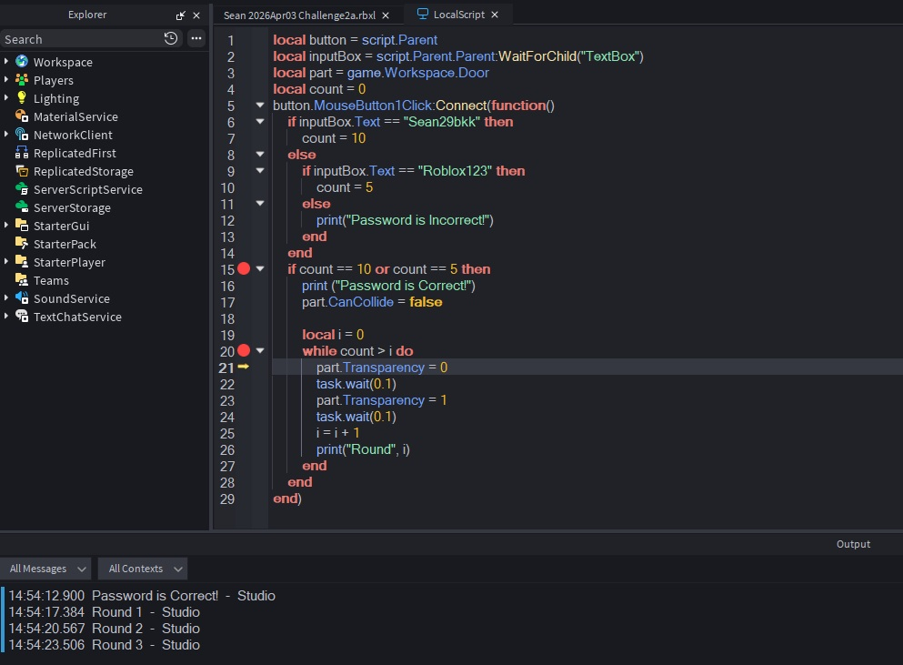
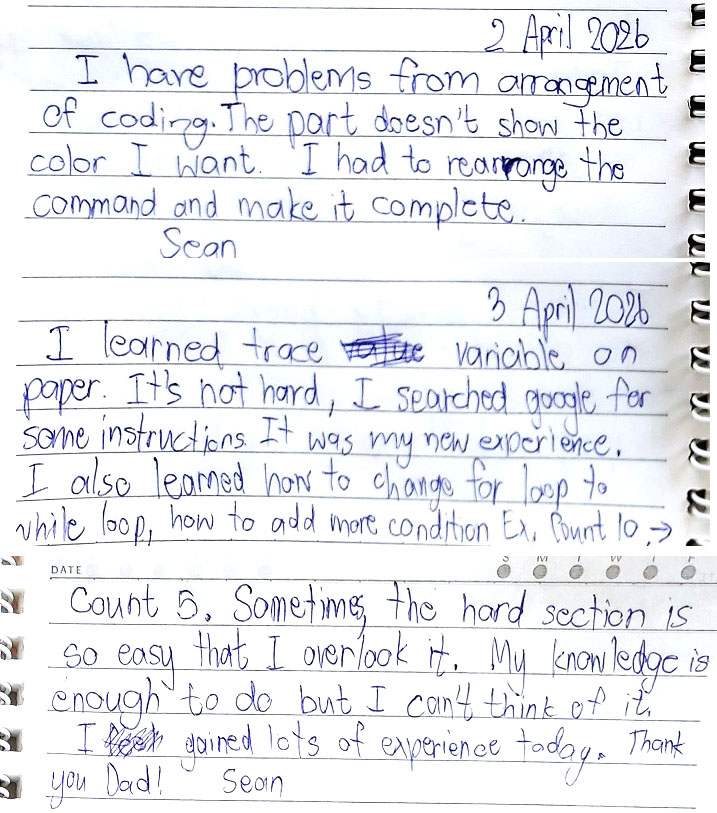

# SECTION 1 — Identity & DNA Passport

### [M2604]

## 2026 April Executive Summary
This period represents a critical "Engineering Breakthrough" for the learner, transitioning from structured rule-following to autonomous design and disciplined software debugging. The learning curve shifted decisively from syntax replication to complex system architectural thinking, multi-axis motion control, and lifecycle dependency management.

The learner demonstrated outstanding engineering resilience when facing complex logic barriers, voluntarily adopting industry-standard "Paper Tracing" methodologies to mathematically debug code rather than relying on guesswork. The month was defined by a substantial increase in "Blank Screen Challenges," where the learner advanced from fill-in-the-blank assignments to writing pure, optimized multi-object systems completely from a blank slate. Furthermore, the learner demonstrated exceptional empirical verification behaviors—building programmatic "visual rulers" to test spatial physics theories—and showcased mature technical leadership by deconstructing abstract event architectures to mentor peers. This comprehensive mastery marks the conclusion of linear structured lessons and triggers the strategic advancement into autonomous Project-Based Learning (Sandbox Mode).

---

### 🎯 Learning Focus
* **Transition from Guesswork to Analytical Tracing:** Voluntarily adopting manual paper tracing to track complex loop variables and eliminate logic race conditions.
* **Deliberate Practice via Blank Screen Challenges:** Rebuilding multi-stage, trigger-based systems completely from an empty editor to achieve pure code autonomy.
* **Empirical Testing & 3D Vector Logic:** Mastering the Cartesian coordinate system by programmatically creating visual models to verify mathematical engine spaces.
* **Clean Code & Refactoring Mindset:** Overcoming system complexity by implementing systematic renaming conventions and consolidating multiple functions into singular optimized logic blocks.

---

### ⚡ Technical Pathways
* ⚙️ **Advanced Motion Logic & Axis Manipulation** (X, Y, Z & Vector3 Height Controls)
* ⚙️ **Nested Control Loops** (Bi-directional Nested For Loops for Up & Down automation)
* ⚙️ **Dynamic Object Mapping** (Dynamic string concatenation `game.Workspace["Wall"..i]`)
* ⚙️ **Inter-Object Lifecycle Dependencies** (Multi-part chain reactions & `Destroy` methods)
* ⚙️ **Event-Driven Programming API** (`Touched` Events & `Humanoid` Class Hierarchy)
* ⚙️ **Independent Code Optimization** (Leveraging Google/AI for functional refactoring)

---

### 📊 Evidence Snapshot  
  
* 📷 Screenshots Captured: 32  
* 🎥 Videos Recorded: 8  
* 📝 Reflections Written: 14  
* ⚙️ Systems Built: 16  
* 🐞 Debugging Cases Solved: 7  
* 📝 Blank Screen Challenges Mastered: 5

---

### 🔗 Associated Technical Labs
Explore the comprehensive technical concepts and documentation demonstrated during this period:
→ [Level 2: Advanced Motion Logic & Event Architectures](../../technical-lab/tech-level2-motion-events.md#L260412a)

📺 *[Watch Final Demonstration Here](#synchronized-double-door-system)*

# SECTION 2 — April Engineering Growth Highlights
[Month-ID: #M2604]
## Overview of Key Learning Milestones

The following milestones capture the most significant moments of Sean's development throughout April 2026. Together, they illustrate his progression from a guided script developer to an autonomous systems architect who designs requirements, optimizes algorithms, and conducts empirical testing. Each block represents a measurable step in deep computational thinking and disciplined software engineering.

---
## 🚀 From Static Coordinates to Dynamic Movement

During April, Sean advanced from understanding static object positioning to engineering dynamic object behavior within a three-dimensional environment. Rather than treating coordinates as fixed values, he learned to continuously update object positions through iterative execution, gradually expanding from single-object movement to synchronized multi-object systems driven by coordinate logic.

<table>
<tr><td colspan="2" align="center" style="background-color: #cccccc; height: 15px; padding: 0;" ><b>Engineering Progression: Coordinate-Based Motion Systems</b></td></tr>
<tr><td width="50%">
          <b>1.Understanding Spatial Coordinates</b> 
          </td>
    <td width="50%">
    <b>2.Controlling Horizontal Motion</b> 
          </td>
</tr>
<tr>
<td width="50%">
          <b>3.Position-Based Event Control</b> 
          </td>
<td width="50%">
          <b>4.Extending Motion into Three Dimensions</b> 
          </td>
</tr>
<tr>
<td width="50%">
          <b>5.Coordinating Multiple Objects</b> 
          </td>
<td width="50%">
        <b>Student's Reflection</b>
          </td></td>
</tr>
<tr>
<td colspan="2" align="left"><b>Student's Note (Transcript)</b>
 "Today, I learned part moving by coding. It is like an elevator but moves on the ground. I used For-i-Loop to do it. I did face a problem today when the Fire is not burning the part, I solved it by making the code know what is Fire. It was easy but very interesting. Sean"
</td>
</tr>
<tr>
<td colspan="2" align="left">
    <b>📷 Mentor’s Insights & Technical Breakdown</b>

    <b>● Key Skills Mastered: </b>3D Spatial Reasoning, Cartesian Coordinate Mapping, Runtime Coordinate Verification, Coordinate-Based Motion Control, Position-Triggered Events, Multi-Axis Programming, Multi-Object Synchronization, and Iterative Motion Logic (For Loops).
    
    <b>● Observation & Insight: </b>"April marked Sean's transition from understanding coordinates as static numerical values to using them as an active control mechanism for software behavior. His learning progressed through five increasingly complex engineering challenges: first establishing a mental model of the XYZ coordinate system, then controlling horizontal motion, introducing position-triggered interactions, extending movement into the vertical axis, and finally synchronizing multiple objects into a functional Double Door mechanism.
    
	Rather than relying on trial-and-error, Sean repeatedly verified live coordinate values through the Output window before modifying his logic. This systematic workflow demonstrates an emerging engineering habit of validating runtime data before making design decisions. By the end of the progression, Sean was no longer simply moving objects; he was engineering predictable object behaviors through coordinate mathematics, iterative execution, and synchronized system control."
</td>
</tr>
<tr><td colspan="2" style="background-color: #cccccc; height: 15px; padding: 0;"></td></tr>
</table>

## 🚀 # Developing Debugging & Runtime Thinking

เนื้อหาควรมี

Paper Variable Tracking
Output Window
Step Into
Rainbow Staircase Execution Order
Student Reflection

Mentor Insight
ไม่ควรพูดเรื่อง Error แต่พูดเรื่อง

Runtime Observation
Execution Order
Trace
Verification
Prediction

ซึ่งเป็นวิธีคิดของ Programmer

<table>
<tr>
<td width="50%">  <b>Evolving Loops via Paper Tracing</b>

	  

	    
	 <!--   
🔍 Click image to isolate and expand code viewer
-->
		 🔍 Click image to isolate and expand code viewer
	

		

	    
	    
× Close

	

	
</td>
<td width="50%"><b>Evolving Loops via Paper Tracing</b>
          </td>
</tr>
<tr>
    <td width="50%">
          <b>Tracking Variable by Trace-Into</b>
          </td>
    <td width="50%">
          <b>Student's Note</b>
          </td>
</tr>
<tr>
    <td  colspan="2" align="left"><b>Student's Note (Transcript)</b>
2April2026 I have problems from arrangement of coding. The part doesn't show the color I want. I had to rearrange the command and make it complete. Sean
    
3April2026 I learned trace variable on paper. It's not hard, I searched google for some instructions. It was my new experience. I also learned how to change For loop to While loop, how to add more condition Ex. Count 10 --> Count 5. Sometimes, the hard section is so easy that I overlook it. <b>My knowledge is enough to do but I can't think of it.</b> I gained lots of experience today. Thank you Dad!.   Sean
</td>
</tr>
<tr>
    <td colspan="2" align="left">
    <b>📷 Mentor’s Insights & Technical Breakdown</b> 
    <b>● Key Skills Mastered: </b>Variable Tracing (Manual Paper Method), Code Refactoring (For to While Loop), Comparative Operators, and Independent Research. 
    <b>● Observation & Insight: </b>"This session highlights an extraordinary intellectual milestone: <b>The Paper-to-Code Bridge</b>. Confronted with a complex 'Logic Wall' regarding dynamic variable checking (checking whether a textbox input matched 'Sean29bkk' to trigger 10 blinks or 'Roblox123' to trigger 5 blinks), Sean stopped guessing and began tracing his variable loops on paper with a pencil. Visualizing exactly how <code>i</code> incremented and compared against the dynamic <code>count</code> boundary unlocked his block instantly. Moving from trial-and-error to systematic variable tracing represents a major leap in engineering discipline. Furthermore, Sean used Google Search independently to verify loop syntax configurations, showing critical self-directed learning behaviors."</td>
</tr>
</table>

## 🚀 From Guided Programming to Independent Program Construction

Sean reached a significant learning milestone during April. Rather than following complete coding examples, he was increasingly given only programming objectives and expected to construct working solutions independently. This transition marked the point where programming knowledge became an internal problem-solving tool rather than a collection of memorized syntax.

|Evidence|สิ่งที่สื่อ|
|---|---|

|   |   |
|---|---|
|Assignment (โจทย์)|ได้รับเพียงเป้าหมาย ไม่ได้รับโค้ดสำเร็จรูป|

|   |   |
|---|---|
|Completed Script / Running Result|สามารถสร้างโปรแกรมได้เอง|

|   |   |
|---|---|
|Student Note|สะท้อนวิธีคิดของผู้เรียน|

|   |   |
|---|---|
|Debug Note|แสดงการแก้ปัญหาด้วยตนเอง|

## 🚀 Transition Toward Independent Software Development

# SECTION 3 — Learning Environment & Mentor Reflection
## Learning Environment

Authentic modern engineering development requires an ecosystem focused on empirical validation, collective code review, structured communication, and leadership. Throughout April, the training framework emphasized direct peer-mentorship and deep self-driven discovery. Lessons moved beyond individual terminal compilation, utilizing team-centered logic translation where abstract rules were transformed into interactive physical models. The following historical entries showcase the environmental parameters supporting Sean's technical jump throughout the month.

<table>
  <tr>
    <td width="50%" align="center"><b>Collaborative Cartesian Spatial Auditing Sessions</b>  </td>
</tr>
<tr>
    <td colspan="2" align="left"><b>📖 Learning Insight</b>
Rather than reviewing abstract coordinate rules on a presentation slide, the group engaged in active collaborative data-model mapping. Using Sean's programmatically generated 'visual rulers,' the brothers audited the 3D game engine grid as a cohesive development team. This hands-on spatial cross-referencing translated mathematical vectors into an intuitive 3D coordinate compass, removing development trial-and-error completely from future structural maps.
</td>
  </tr>
 </table>
 

<table>
  <tr>
    <td align="center"><b>Deconstructing Global Instances via Peer Mentorship</b>  <video src="./assets/202604-assets/sec3-sean2604-peer-teaching.mp4" autoplay loop muted playsinline width="100%" style="border-radius: 6px; cursor: pointer; box-shadow: 0 4px 10px rgba(0,0,0,0.3);" onclick="this.muted=false; if(this.requestFullscreen){this.requestFullscreen();}else if(this.webkitRequestFullscreen){this.webkitRequestFullscreen();}" onfullscreenchange="if(!document.fullscreenElement){this.muted=true;}" onwebkitfullscreenchange="if(!document.webkitFullscreenElement){this.webkitFullscreenElement?null:this.muted=true;}"></video>
👆 Click video to watch in Fullscreen with sound
</td>
</tr>
<tr>
    <td align="left"><b>📖 Learning Insight</b>
True conceptual mastery is verified through the ability to transmit specialized information to others. After mastering instance properties and programmatically generating visual fire states, Sean took complete operational initiative to act as Lead Mentor for his sibling, Gann. By breaking down initialization hierarchies and explaining how components inherit parent constraints inside a live code-review session, Sean demonstrated supreme structural command, translating professional engineering syntax into accessible, logical rules for younger developers.
</td>
  </tr>
 </table>

## 2026 April Mentor Reflection 

<b>Preparing for Project-Based Learning</b>

Throughout April, the instructional focus shifted from introducing new programming syntax toward strengthening Sean's computational thinking through repeated application of core concepts. Rather than accelerating into more advanced topics such as data persistence or reusable functions, the learning activities deliberately revisited coordinates, loops, conditional logic, debugging, and blank-screen programming in increasingly varied situations.

The objective was not to maximize the number of programming concepts learned, but to develop stable mental models that Sean could repeatedly apply when encountering unfamiliar problems. By the end of the month, he had reached a stage where solving new challenges depended less on acquiring additional syntax and more on combining existing knowledge creatively. This transition prepared him for project-based software development, where authentic engineering problems would naturally drive the introduction of new concepts in the following months.

Sean's own reflection captured this transition well:

<b><I>"My knowledge is enough to do but I can't think of it."</I></b>

This realization marked an important milestone in Sean's learning journey. The next stage would focus not on learning more syntax, but on expanding creativity, software design thinking, and engineering experience through authentic software projects.

