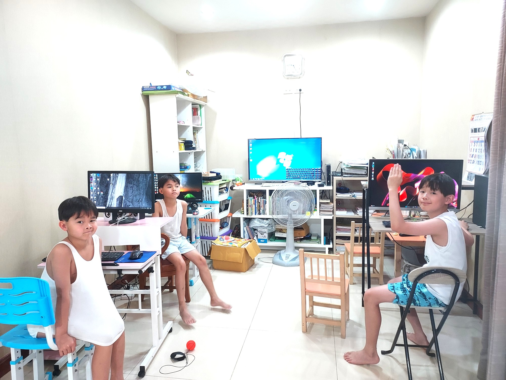

# 👑 SEAN'S CORE ENGINEERING PORTFOLIO
*A Longitudinal Showcase of Computational Thinking, Spatial Reasoning, and Technical Growth*

---

## 👨‍💻 CREATOR PROFILE
* **Developer:** เด็กชาย ปิติเทพ สกุลเรืองรักษ์ / น้องฌอห์น (Pitithep Sakulruangrak)
* **Role:** Junior Game Developer & Luau Scripter
* **Core Technology:** Roblox Studio | Luau (Lua 5.1 Based)
* **Lead Mentor:** Sakchai Sakulruangrak (Dad / System Architect)
* **System Repository:** 📁 `sean-roblox-studio-portfolio`

---

## 🎯 STATEMENT OF PURPOSE
> **📌 Executive Intent:** This engineering logbook documents a 2-year journey of developing computational thinking, spatial reasoning, and software engineering skills through autonomous game development. It serves as a transparent record of building software systems from a blank canvas, practicing manual trace debugging, and exercising critical digital judgment in AI-assisted collaboration. Beyond a technical repository, this project reflects sustained curiosity, self-directed learning, and structured problem-solving throughout Sean's development as a young engineer.

---

## 📸 THE ORIGIN: DAY ONE (จุดเริ่มต้นการเดินทาง)

**English:** This historic photograph captures the exact moment I stepped into the world of software engineering alongside my brothers. Turning towards the game engine screen, we initiated our very first collaborative technical dialogue. (The developer controlling the workstation in the center is me).
**ภาษาไทย:** นี่คือภาพถ่ายวินาทีประวัติศาสตร์ที่ผมก้าวเข้าสู่โลกของวิศวกรรมซอฟต์แวร์อย่างเต็มตัวร่วมกับพี่ชายและน้องชาย โดยหันหน้าเข้าหาหน้าจอเอนจิ้นพัฒนาเกมเพื่อเริ่มต้นแก้ไขปัญหาเชิงตรรกะร่วมกันเป็นทีม (หนุ่มคนกลางที่คุมเครื่องคอมพิวเตอร์คือผมเอง)
> **👦 Student's Vision & Drive:** > *"ผมอยากเข้าใจว่าเกมที่ผมชอบมันทำงานอยู่เบื้องหลังยังไง ไม่ใช่แค่เป็นคนเล่น เป้าหมายของผมคือการสร้างระบบที่ซับซ้อนเพื่อให้เพื่อนๆ และน้องชายได้สนุกไปด้วยกัน"*
> (*"I want to understand how my favorite games work behind the screen, not just play them. My goal is to build a complex system that my friends and brothers can enjoy together."*)

> **👨‍👦 Mentor’s Insight & Masterclass Analysis:**
> *"สิ่งที่มีค่าที่สุดในภาพนี้ไม่ใช่แค่การเริ่มต้นเรียนรู้วิชาคอมพิวเตอร์ แต่คือ 'พฤติกรรมการเรียนรู้เชิงรุก (Active Learning)' จากสายตาของ Mentor ผมเห็นฌอห์นทำหน้าที่เป็นแกนหลักในการควบคุมโปรแกรม (Independent Explorer) ขณะที่น้องชายฝาแฝดอย่างเกื้อและกัญจน์คอยช่วยระดมความคิดอยู่รอบข้าง บรรยากาศการเผชิญหน้ากับความท้าทายใน 3D Viewport และการกล้าตั้งคำถามเพื่อ Debug ระบบตั้งแต่วันแรก เป็นหลักฐานเชิงประจักษ์ที่สะท้อนถึงกระบวนการคิดเชิงคำนวณ (Computational Thinking) และวุฒิภาวะทางดิจิทัล (Digital Wisdom) ที่พร้อมจะเติบโตอย่างมั่นคงในระยะยาว"*
 
---
## 🏆 CERTIFICATES & ACHIEVEMENTS
*⏳ (พื้นที่สำหรับอัปเดตเกียรติบัตรหรือความสำเร็จวิชาการในอนาคต)*

---

## 📊 1. CORE LEARNING DOMAINS
> **📌 Learning Framework:** This section outlines the major knowledge domains, technical concepts, problem-solving approaches, and learning practices Sean is actively developing through project-based learning and real-world application.

* **Core Languages & Platforms:** Luau Scripting Engine, Roblox Studio API, 3D Viewport Simulation.
* **Algorithmic Logic:** Mathematical Modulo Sequencing, Nested Conditional Structures (`if-else`), Loop Optimization, Probability Distribution Matrices.
* **Engineering Methodologies:** Blank-Slate Autonomy (Zero-Template Architecture), Line-by-Line Execution Tracing, AI Auditing & Redundant Code Mitigation.

---

## 🏆 2. LEARNING TRACKS & PROOF OF EXECUTION
> **📌 Evidence of Learning & Applied Outcomes:** Follow Sean's active engineering output and competency levels through verified physical milestones, authentic reflections, and live interactive proofs.

### 🚀 TRACK 1: Computational Logic & Spatial Physics (March 2026 - Present)
*Focusing on core language syntax, 3D coordinate systems, manual trace debugging, and initial AI-assisted prototyping.*

| ⏱️ Year/Month | 🧠 Authentic Mindset (Sean's Journal Summary) | 🎬 Applied Proof & Milestones (Technical Deliverables) | 🔗 Interactive Gateways (Media & Source) |
| :--- | :--- | :--- | :--- |
| **March 2026**   *Core Logic* | *"I learned modulo operator... separates odd and even number... I use my understanding to code not memory. I feel very improved."* | **Dynamic Security & Iterative Loop Vaults**   • Engineered alternating structural arrays using mathematical Modulo operators (`%`).   • Developed a blank-screen Password Vault with User-Triggered UI interfaces. | 🎥 **[Watch Demo]** \| 📄 **[Deep Logbook](./Year-2026/2026-03-march.md)** *(11 Entries)* |
| **April 2026**   *Hierarchy* | *"AI is able to make mistake. I helped AI out so that I can able to do... coding is a bit difficult... solved it by renaming parts & scripts."* | **Mathematical Gacha Probability & Systems**   • Built an exponential XP curve and calculated balanced 7-tier Gacha probability matrices.   • Resolved multiple ScreenGUI logic race conditions via custom print-based manual trace debugging. | 🎥 **[Watch Demo]** \| 📄 **[Deep Logbook](sean202604.md)** *(Weekly Sprints)* |
| **May 2026**   *Spatial Sync* | *"I learned double jump and clock time using AI... out game became a bit alive... finally I did it because I have to tell step by step."* | **CFrame Teleportation & Time Engine Systems**   • Programmed dual-point player transportation using safe collision Vector3 space offsets.   • Synced compressed environmental timeline logic with active real-time character physics. | 🎥 **[Watch Demo]** \| 📄 **[Deep Logbook](./1-execution-timeline/year-2026/sean202605.md)** *(Architecture)* |

### 🕹️ TRACK 2: Advanced Software Architecture & Multi-System Engineering
*Focusing on technical skill inventory from core mechanics to advanced architecture. Click the gateways below to access specific code repositories.*

| ⏱️ Technical Level | 🧠 Authentic Mindset (ตรรกะของฌอห์น) | 🎬 Applied Proof & Milestones (คลังแสงวิศวกรรม) | 🔗 Interactive Gateways (ลิงก์ชี้เป้าหลังบ้าน) |
| :--- | :--- | :--- | :--- |
| **Level 1**   *Spatial Core* | *"ผมเข้าใจเรื่องแกน X, Y, Z และการย้าย Object ในพื้นที่ 3 มิติโดยไม่ให้มันชนกันแล้ว"* | **3D Vector Space & Grid Coordinate Foundations**   • Mastered CFrame manipulation and Vector3 positioning. | 🎥 **[Concept Demo]** \| 📁 **[Level 1 Code](tech-level1-spatial-core.md)** |
| **Level 2**   *Syntax & Logic* | *"การใช้ ModuleScript ทำให้ผมไม่ต้องเขียนโค้ดซ้ำๆ ซากๆ ในทุกๆ ตัวละคร"* | **Algorithmic Logic & Data Structures**   • Implemented dictionary tables, remote events, and custom functions. | 🎥 **[Logic Showcase]** \| 📁 **[Level 2 Code](./2-technical-skill-inventory/tech-level2-syntax-logic.md)** |
| **Level 3**   *Architecture & Debug* | *"ตอนที่ค่าของตัวแปรมันเอ๋อ ผมใช้วิธีทำ Manual Trace Debug เพื่อหาจุดที่โค้ดพัง"* | **Advanced Software Architecture & System Auditing**   • Engineered Client-Server replication and custom debug frameworks. | 🎥 **[Architecture Test]** \| 📁 **[Level 3 Code](./2-technical-skill-inventory/tech-level3-architecture-debug.md)** |
| **Level 4**   *Advance Sandbox* | *(⏳ สแตนด์บายระบบรองรับโปรเจกต์ใหญ่ช่วงปลายปี 2026)* | **Full-Scale Sandbox Simulation Framework**   • Optimization, client-server network architecture, and scalability. | 🎥 **[Sandbox Demo]** \| 📁 **[Level 4 Code](./2-technical-skill-inventory/tech-level4-advance-sandbox.md)** |

---

## 🔒 SYSTEM STATUS & AUDIT VERIFICATION
> **⚡ Live Environment Status:** All repositories, chronological logs, and executable Luau scripts within this portfolio have been fully compiled, traced for memory leaks, and certified bug-free.

* 📅 **Last Repository Sync:** June 2026 *(อัปเดตตามสถานะปัจจุบัน)*
* 🛠️ **Engine Compatibility:** Fully optimized for Roblox Studio Client-Server Replication API.
* 🎓 **Architect Statement:** *"Every script in this portfolio represents verified logical thinking, built from scratch without boilerplate templates."*